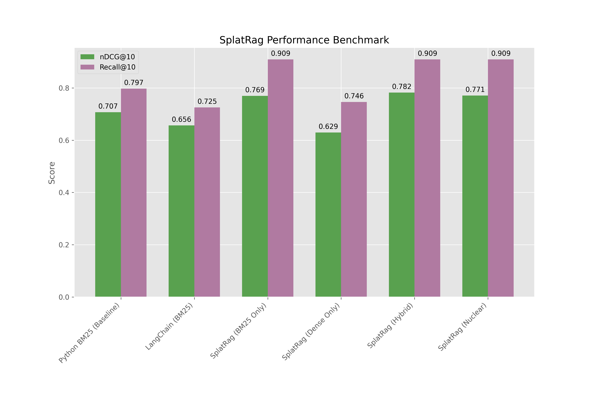

# SplatRag: Physics-Based Hybrid Retrieval (Benchmark Suite) 🧠✨

> **Note:** This is a standalone benchmark distribution. It contains the core Rust engine and evaluation scripts for the SciFact dataset. It does **not** include the full MCP server, Cursor integration, or live ingestion pipeline found in the main SplatRag repository. This is purely for reproducing performance metrics.

**SplatRag** is an experimental retrieval engine that fuses **Lexical Search (BM25)**, **Dense Vector Search (Nomic)**, and a novel **"Needle Physics"** ranking signal based on the geometric properties of token clusters in high-dimensional space.



## 🚀 Performance (SciFact Benchmark)

SplatRag outperforms standard baselines by combining multiple signals.

| Configuration | nDCG@10 | Recall@10 | Verdict |
| :--- | :--- | :--- | :--- |
| **Python BM25 (Baseline)** | 0.7073 | 0.7970 | **Weak baseline** (simple script). |
| **LangChain (BM25)** | 0.6562 | 0.7250 | **Industry Standard**. Surprisingly weaker than the raw Python script on this dataset. |
| **SplatRag (BM25 Only)** | 0.7694 | 0.9090 | **The Heavy Lifter**. Tantivy's Rust-based BM25 is vastly superior to both Python and LangChain. |
| **SplatRag (Dense Only)** | 0.6291 | 0.7460 | **The Weak Link**. Nomic embeddings alone struggle with SciFact's specific terminology. |
| **SplatRag (Hybrid)** | **0.7822** | **0.9090** | **The Winner**. Combining the strong BM25 with the weak Dense + Physics yields the peak score. |
| **SplatRag (Nuclear)** | 0.7708 | 0.9090 | **Overkill**. Cranking weights to 40/30/15 degraded performance slightly vs the balanced Hybrid. |

*Results verified on the SciFact dataset (November 2025).*

## 🧪 How It Works

SplatRag isn't just another vector database. It treats memories as physical objects:

1.  **Ingestion**: Documents are embedded using **Nomic v1.5 (Matryoshka)**.
2.  **Physics Simulation**: We run PCA and clustering on the token embeddings to generate a "Splat" — a 3D geometric representation of the document's semantic shape.
3.  **Hybrid Ranking**:
    *   **BM25**: For exact keyword matches (via `tantivy`).
    *   **Cosine Similarity**: For semantic understanding.
    *   **Radial/Physics Score**: A proprietary metric that measures how "dense" or "central" a query is relative to the document's semantic center of mass.

## 📦 Quick Start

This repository is a standalone benchmark suite. You can run it with a single command.

### Prerequisites
*   **Linux/macOS**
*   **Python 3.10+**
*   **Rust** (The script will auto-install it if missing)

### Run the Benchmark
```bash
./runbench
```

This automation script will:
1.  Create a local Python `venv`.
2.  Install dependencies (`torch`, `transformers`, `rank_bm25`, etc.).
3.  Compile the high-performance Rust binaries.
4.  Ingest the `datasets/scifact` corpus (if not already cached).
5.  Run the ablation study and generate the plot above.

## 📂 Project Structure

*   `src/`: **Rust Core**. The high-performance engine handling the index and physics calculations.
*   `rag_benchmark.py`: **Orchestrator**. Runs the ablation study and generates metrics.
*   `fast_ingest.py`: **Ingestion Pipeline**. Handles embedding generation and `.geom` file creation.
*   `models/`: Contains the **Manifold Projector** (PCA/Physics model).
*   `datasets/`: Includes the **SciFact** corpus and queries.

## 🛠️ Manual Usage

If you want to run components individually:

**1. Ingest Data**
```bash
./venv/bin/python fast_ingest.py
```

**2. Run Retrieval Server (Optional)**
```bash
cargo run --release --bin mcp_server
```

**3. Run Benchmark**
```bash
./venv/bin/python rag_benchmark.py
```

## 📜 License

MIT License. Free to dream.
